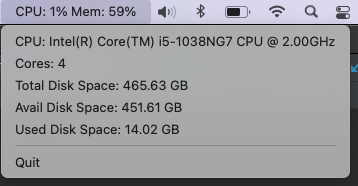

# Mini Activity Menu Bar Monitor
CPU and Memory usage monitoring tool for OS Mac menu bar

### Screenshot Version 0.1.0



## Install

### MacOS
Create following folder structure and assets in ~/Applications/

```
MonitorApp.app/
  Contents/
    Info.plist
    MacOS/
```

Move go binary to MacOS/

### Other Platforms
[Systray](https://github.com/getlantern/systray) for more detailed instructions on how to install on other platforms
